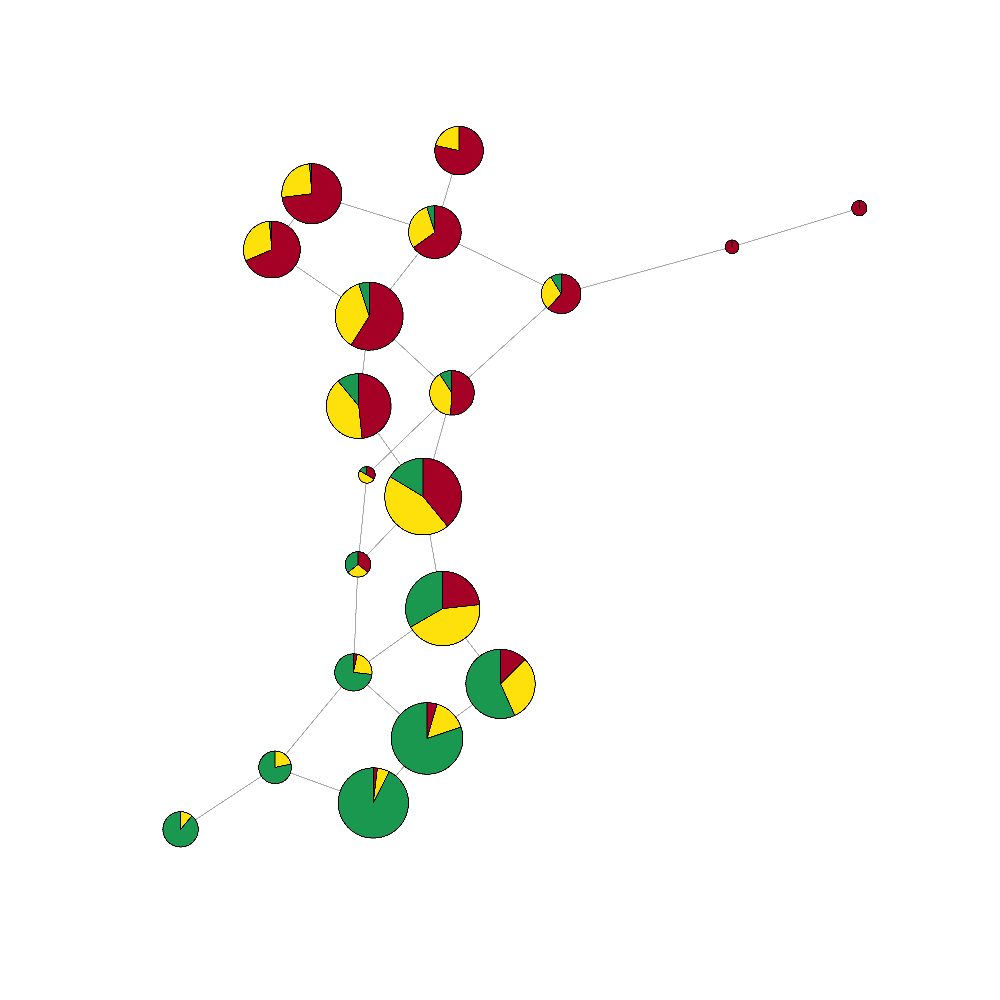
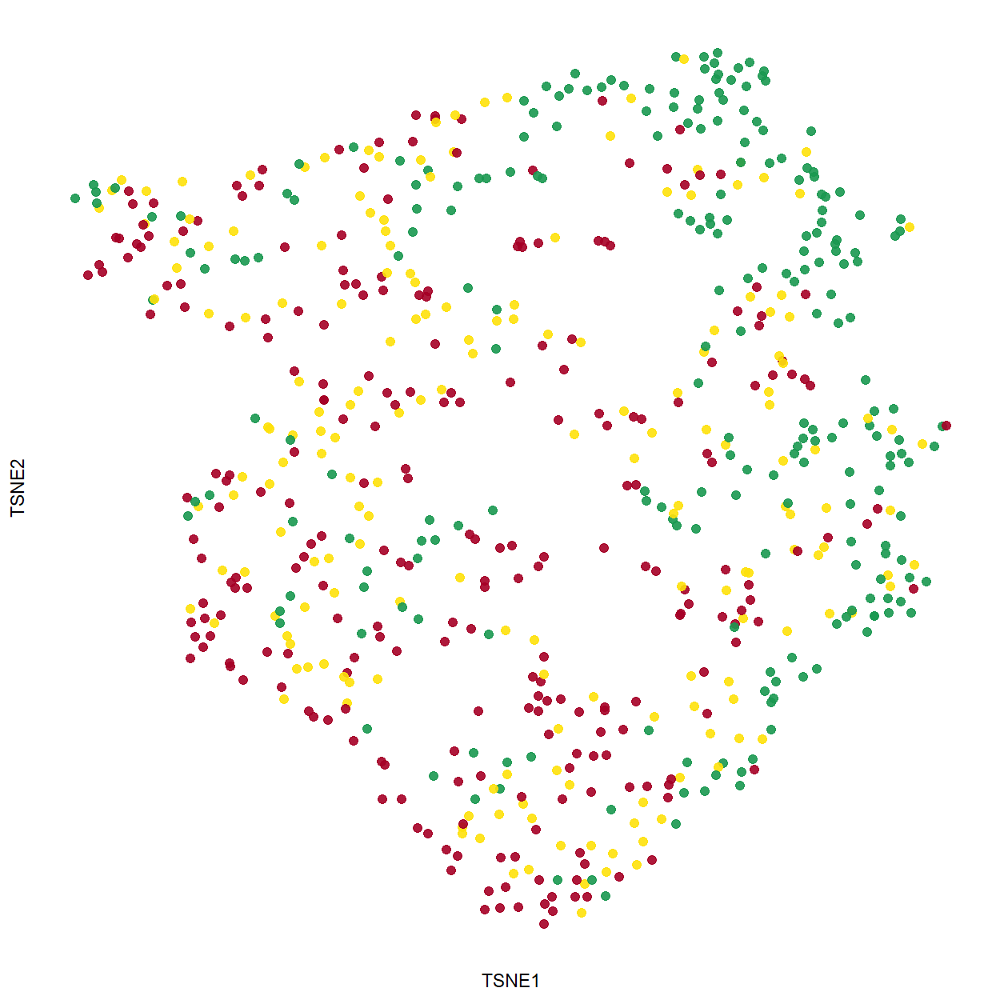

# Mapper-Based Localized Prediction with Data-Driven Cover Selection for High-Dimensional Data

## Overview
This repository implements a **Mapper-based localized prediction framework** for high-dimensional data using **Topological Data Analysis (TDA)**. The method leverages the geometric and connectivity structure of data to perform nonparametric prediction via graph-induced neighborhoods.

---

## Key Idea

We model prediction as estimation of conditional probabilities:

$$
P(Y \mid X = x)
$$

where estimation is based on observations selected through **Mapper graph neighborhoods**, rather than standard metric-based neighborhoods.

- Data is projected via a **filter function: Ordinal Accelerated Sparse Discriminant Analysis (OASDA)**
- A **data-driven overlapping cover** is constructed
- **Clustering + graph connectivity** defines local neighborhoods
- Prediction is performed via **localized weighted averaging**

---

## Features

- 📊 Topology-aware prediction  
- 🔬 Designed for high-dimensional biomedical data  
- ⚙️ Data-driven cover selection (bias–variance trade-off)  
- 📈 Works for:
  - Ordinal outcomes 
  - Nominal classification  
  - Binary outcomes  
- 🔍 Permutation-based variable importance  
- 📐 Theoretical guarantees:
  - Consistency  
  - Bayes-risk optimality  

---

## Repository Structure

```text
.
├── Simulation Study/
│   ├── Scenario 1/
│   └── Scenario 2/
├── Real Data Analysis/
│   ├── PPMI/
│   └── UCSC Xena/
├── Images/
│   ├── PPMI.png
│   └── Final_UCSC_Xena.png
└── README.md

```

---

## Method Summary

### 1. Mapper Construction
- Filter: OASDA projection  
- Cover: overlapping intervals  
- Clustering: hierarchical (Ward’s method)  
- Output: Mapper graph  

---

### 2. Prediction Rule

For a new point:

- Identify relevant intervals  
- Assign to nearest clusters  
- Aggregate over graph-connected nodes  
- Compute weighted class probabilities  

---

### 3. Cover Selection
 
Parameters are selected using a data-driven bias–variance trade-off
where Loss Function: 

$$
L(S,l)=\rho S^{-1}+(1-\rho)l^{-4}, \quad \rho\in(0,1)
$$

under constraint 

$$
S+(l-1)q=n, \quad \frac{S}{2} \le q \le S
$$

 
Optimal scaling:

- Number of intervals: `l=\left( \frac{n(1 - \rho)}{\rho} \right)^{1/5}`  
- Observations per interval: `S=2n/(l^*+1)`
- Shift between consecutive intervals: `q=n/(l^*+1)`  
- So, overlap: `q/S=1/2`
- The tuning parameter `\rho` is selected by cross-validated predictive performance over a prespecified grid 

This balances:
- Bias (oversmoothing)  
- Variance (instability)  

---

## Simulation Study

We evaluate performance under:

- Nonlinear branching structures  
- Skewed distributions (log-normal)  
- Correlated predictors  
- Varying noise levels  
- Sample sizes: 250, 500, 1000  

### Key Findings

- Outperforms classical models under heterogeneous structure  
- Comparable performance under homogeneous settings  
- Strong robustness to noise  

---

## Applications

### 1. Parkinson’s Disease (PPMI)
Predict Hoehn–Yahr stage  

<table align="center" width="100%">
<tr>
<td align="center" width="50%">
<br>
<b>Mapper Plot</b>
</td>

<td align="center" width="50%">
<br>
<b>t-SNE Plot</b>
</td>
</tr>
</table>

### 2. TCGA Glioma (UCSC Xena)
Classify tumor severity from RNA-seq data  

## Visualization

### UCSC Xena (TCGA Glioma Data)

<p align="center">
  
</p>

This figure illustrates Mapper-derived structure in high-dimensional RNA-seq data.


---

## Requirements

- R (recommended)

---


## How to Use

1. Clone the repository:
git clone https://github.com/MoinulAhsan/TDA_Mapper_Prediction.git

2. Navigate to:

Simulation Study/  
Real Data Analysis/  

3. Run scripts to:

- Generate data  
- Build Mapper graph  
- Perform prediction  
- Evaluate performance  

---

## Citation

If you use this work, please cite:

Ahsan, M. M., Das, P., Mukhopadhyay, N. D.  

*Mapper-Based Localized Prediction with Data-Driven Cover Selection for High-Dimensional Data*
---

## Contact

**Md Moinul Ahsan**  
*Virginia Commonwealth University*  
📧 Email: [ahsanm8@vcu.edu](mailto:ahsanm8@vcu.edu)

---

## Keywords

**Topological Data Analysis (TDA)**, Mapper, Prediction, High-Dimensional Data, Nonparametric Classification, Biomedical Data